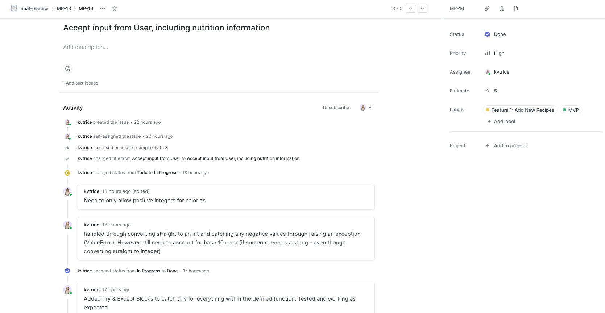
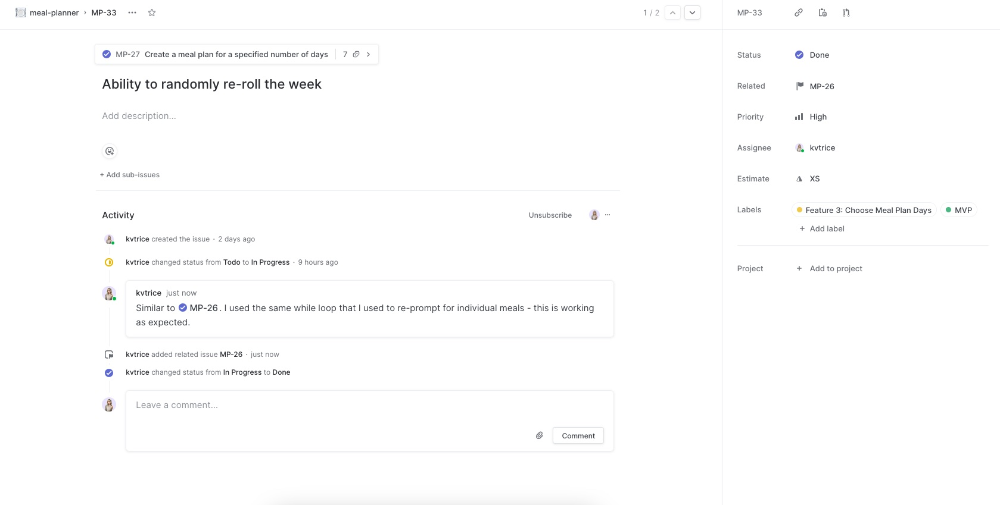

# Meal Planner Terminal App

## Links
* [Github Repository](https://github.com/kvtrice/meal-planner)
* Slide Deck
* [Development Plan (Linear)](https://linear.app/kats-workspace/join/88596d7e69b639b4a651783417b35e23?s=4)
* [Code Style Guide (Pep8)](https://peps.python.org/pep-0008/#documentation-strings)

# Table of Contents
* [Purpose and Overview](#purpose-and-overview)
* [Features](#features)
* [Development Plan](#development-plan)
* [Installation and Help Docs](#help-and-installation-instructions)
* [References](#references)

## Purpose and Overview
Meal Planner is a terminal application that helps make meal planning easy. As a user, you're able to define what your daily calorie target is (e.g. 1800 calories) and from there the program will randomly generate a meal plan that's within an acceptable range to the target the user has set. 

The meal plan will consist of 5 meals (Breakfast, Lunch, Dinner and 2 snacks) and the meals are chosen from a CSV list of recipes, that the user is able to both view and add to.

This application has allowed me to demonstrate my ability to effectively accept user input and interact with file systems, alongside the broader ability to design and implement a commandline application complete with the utilisation of multiple pakages and unit testing.

## Features
There are a number of key features of my application, with each outlined at a high level below:

### 1. Add a new recipe

The user is able to add a new recipe to the recipe list in two ways:
* Via the user menu within the application
* Via a command line script outside of the application

In each case, the user is required to enter the recipe `title`, the `ingredients` and the `calories` (for 1 serving). Once provided, the application appends this new entry to the existing CSV file of recipes (which comes pre-loaded with over 200 recipes).

### 2. Choose how many days the user wants a meal plan for

Initially I began implementing the ability to create a meal plan for a single day. Once this was working successfully I then created a secondary option, re-using much of the functionality from the single day option, to then enable the user the ability to choose a custom number of days to create meal plans for (e.g. for 5 days). This is improved upon from my initial idea of creating a _weekly_ meal plan - where I ran into concerns around what happens if a user doesn't need the full 7 days (such as if they have dinner plans one night). So landed on a custom option that was much more versatile. 

This also led me to the realisation that using the custom number of days also actually covers the use case of a single meal plan, as the user can simply choose to create a meal plan for 1 day. This led to a refactor that removed the single day option and improved upon the functionality of the custom number of days option. 

### 3. Generate (and optionally regenerate) a meal plan

The core functionality of this application is in generating a meal plan for the user. At the beginning of the user journey, the user is prompted to provide a calorie target for each day (e.g. 1800 calories). Once this is entered, the application will take that target number and based on some pre-defined ranges, will determine roughly what the calories for each meal should be in order to hit close to the users calorie target.

As an example, if the users goal is 1800 calories, then given there will be 5 meals provided to the user for the day, I wanted to have a rough range of calories as a guide for each meal, such as:

```
If calorie target is between 1701 - 2000 then:

Meal 1 (Breakfast): 400 Calories
Meal 2 (Lunch): 400 Calories
Meal 3 (Dinner): 600 Calories
Meal 4 (Snack 1): 300 Calories
Meal 5 (Snack 2): 200 Calories
```

For each range I allowed a variation of `+- 75` each side

The program then iterates through the recipe csv, searching for meals that adequately fill the calorie target defined; shuffling the recipe list each time and removing it so that the options are randomised and the user doesn't get duplicate meals.

Finally, at the end of each day the calories for each meal are summed together and the total is compared to the calorie target that the user set - if it's within `+- 75` of the target; then the meal is considered complete for that day. Otherwise, the loop repeats until a meal plan within an acceptable range is created.

Additionally, once the user is shown their meal plan, they're given the option to manually regenerate it if they want to (e.g. if they don't like the meals). They can also optionally choose to change their calorie target upon regeneration or keep the orginal target they set.


### 4. Save a meal plan

Finally, once the user is happy with their plan, the plan is displayed to them on screen, complete with numbered days and semantic meal names. Once the user is happy with their meal they can save it, and upon doing so they are prompted to enter a `filename`. The meal plan is then saved to a file with this filename in the source directory for access later. The data & time of the meal plan is included so if multiple meal plans are savevd, the user can distinguish between them.

## Development Plan

#### Prioritisation Approach

I started out by getting all my ideas for the application out on the development board. I realised quickly that I had more ideas that what would likely be feasible in the amount of time I had so I prioritised things baed on what was a must-have, or `MVP` vs. what was a `nice-to-have` (if time permits).

MVP features were features that were critical to the core functionality of my application (creating a meal plan, adding a recipe), where as the nice-to-have's were features that whilst they could potentially enhance the user experience, they wouldn't utlimately make or break the experience. Each ticket was also estimated using t-shirt sizing (S, M, L etc.), and based on this I was able to prioritize my time and attention.

I also labelled each card with the title of the feature that it was related to, and built out sub-issues under each main issue to outline the steps required in order to implement it - at least, my best attempt at what I thought was the best solution at the time... many of my initial approaches changed or were tweaked as I built out the project and learnt more and more.

Ultimately, a few `nice-to-have` features didn't make the cut based on their priority; the overview can be seen below:

#### MVP Features
* Feature 1: Add a new recipe - `implemented`
    * Import pre-populated list of recipes - `implemented`
    * View recipe list - `implemented`
* Feature 2: Create a meal plan based on users calorie target - `implemented`
* Feature 3: Create a meal plan for specified number of days - `implemented`
    * Ability to re-roll the meal plan - `implemented`

#### Nice-to-have Features
* Feature 4: Print meal plan to a CSV - `changed`
    * Requirement changed to instead print to a text file - `implemented`   
* Feature 5: Remove a recipe from the recipe list - `cancelled`
* Feature 6: Allow user to set dietary requirements for their meal plan - `cancelled`
* Feature 7: Allow user to set custom calories per meal - `cancelled`

#### Guide to Linear Boards


**Day 1**




**Day 2**


**Day 3**

Day start:


Day end:





**Day 4**

Day start:


Day mid:


Day end:


**Day 5**


**Feature Checklists**


## Help and Installation Instructions
#### Steps to install the application


#### Dependencies


#### System and Hardware Requirements


#### How to use the application


## References